# 🏗️ ChatSphere Architecture Diagrams

> Interactive Mermaid diagrams for visualizing the ChatSphere architecture.
> These diagrams render on GitHub, GitLab, and most Markdown viewers.

---

## System Overview

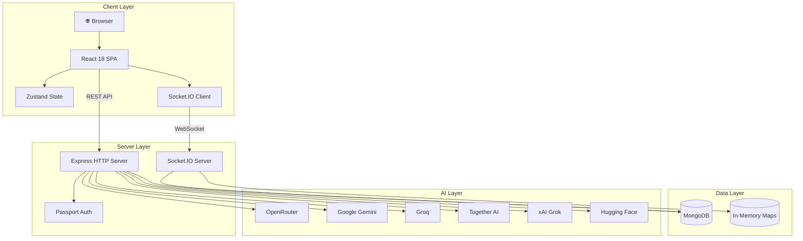

---

## Authentication Flow

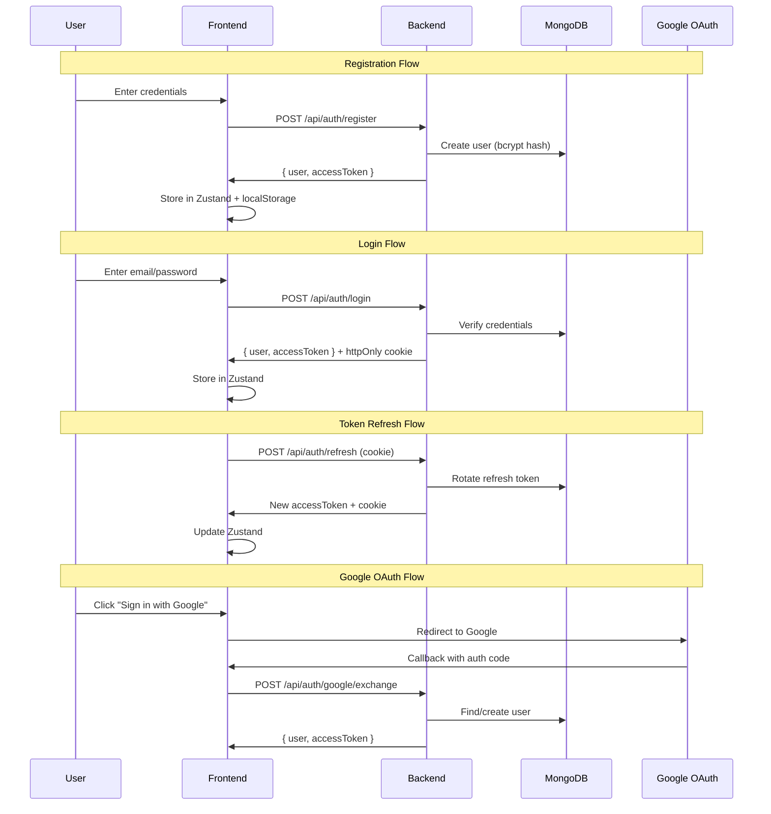

---

## Real-Time Chat Architecture

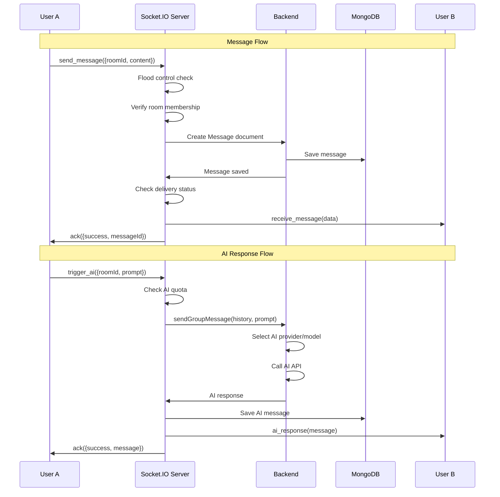

---

## AI Provider Routing

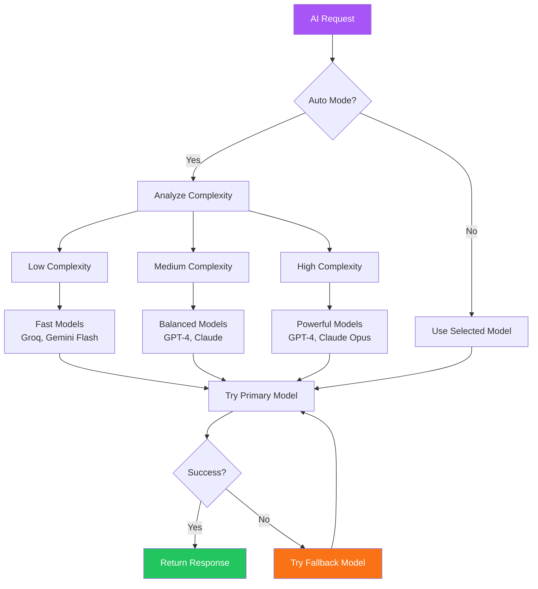

---

## Database Schema (ER Diagram)

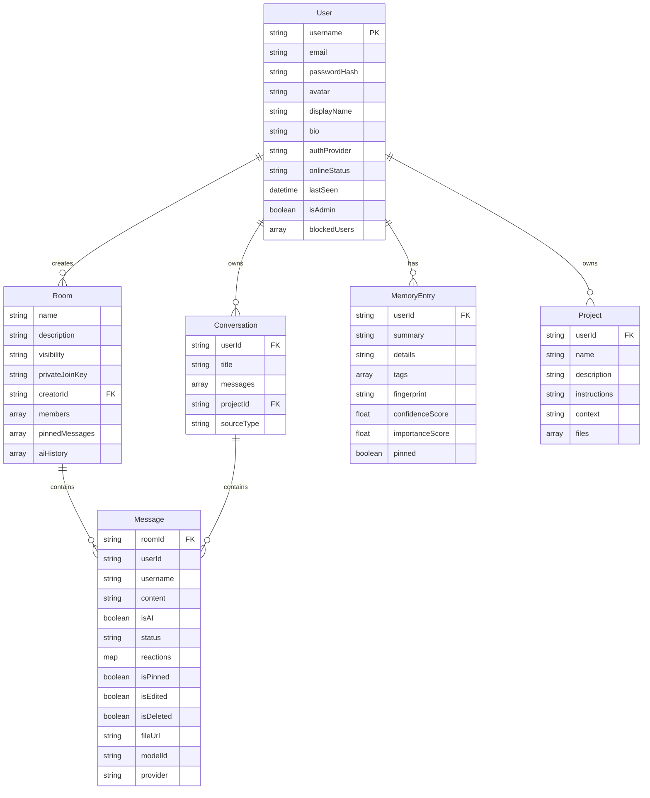

---

## Socket.IO Event Flow

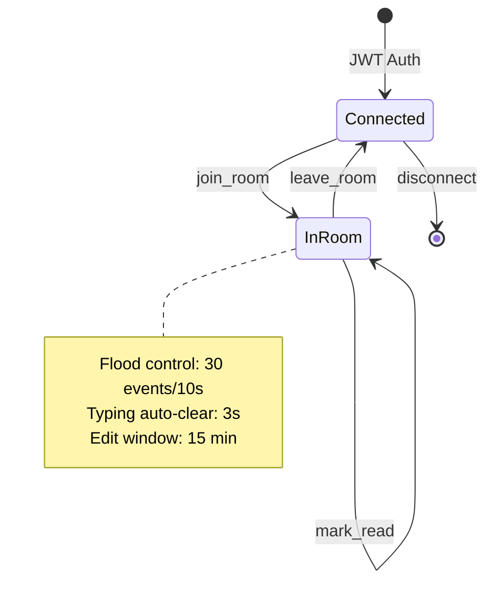

---

## Frontend Component Hierarchy

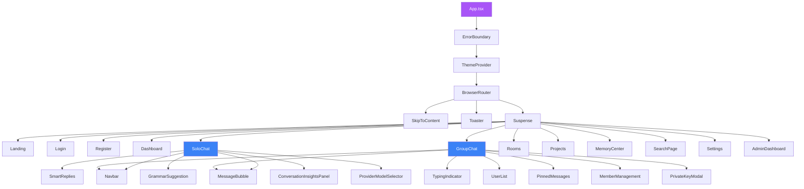

---

## State Management Architecture

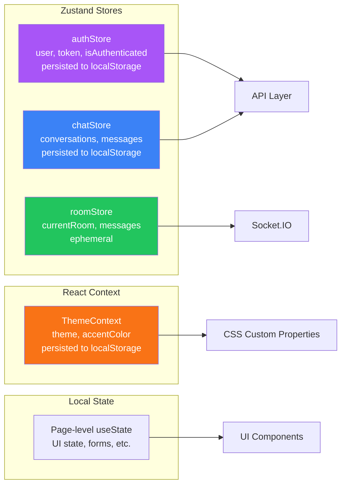

---

## Deployment Architecture

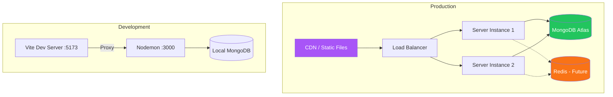

---

## Security Layers

```mermaid
graph TB
    subgraph "Client Security"
        CSP[CSP Headers]
        XSS[XSS Protection]
        HTTPS[HTTPS Only]
    end

    subgraph "Transport Security"
        CORS[CORS Policy]
        HSTS[HSTS Headers]
        TLS[TLS 1.3]
    end

    subgraph "Authentication"
        JWT[JWT Access Token<br/>15min expiry]
        Refresh[Refresh Token<br/>7 day, httpOnly cookie]
        OAuth[Google OAuth 2.0]
    end

    subgraph "Authorization"
        RBAC[Role-Based Access<br/>creator > admin > mod > member]
        RoomAuth[Room Membership]
        BlockCheck[Block Relationships]
    end

    subgraph "Input Validation"
        Sanitize[HTML Sanitization]
        Validate[Schema Validation]
        RateLimit[Rate Limiting]
        Flood[Flood Control]
    end

    CSP --> XSS
    CORS --> HSTS
    JWT --> Refresh
    RBAC --> RoomAuth
    Sanitize --> Validate
    RateLimit --> Flood

    style JWT fill:#A855F7,color:white
    style RBAC fill:#3B82F6,color:white
    style RateLimit fill:#F97316,color:white
```

---

## Memory System Architecture

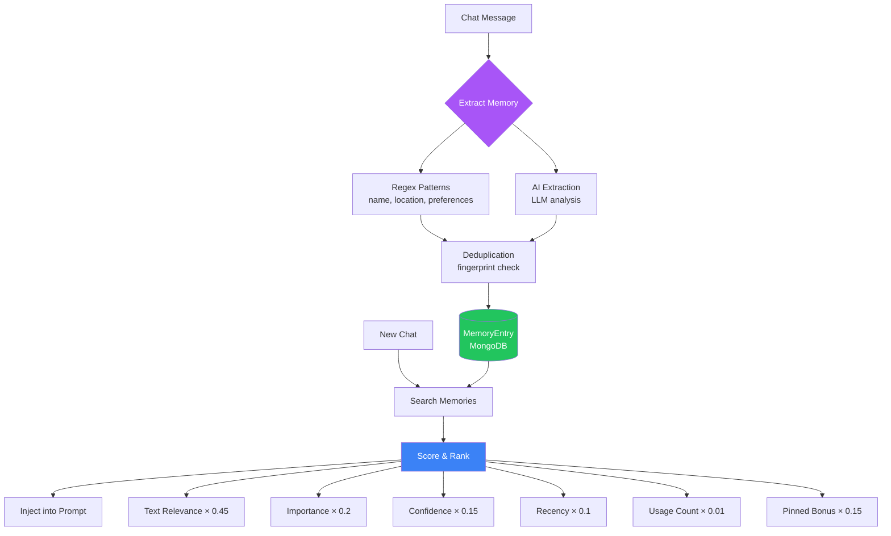

---

## Performance Optimization Map

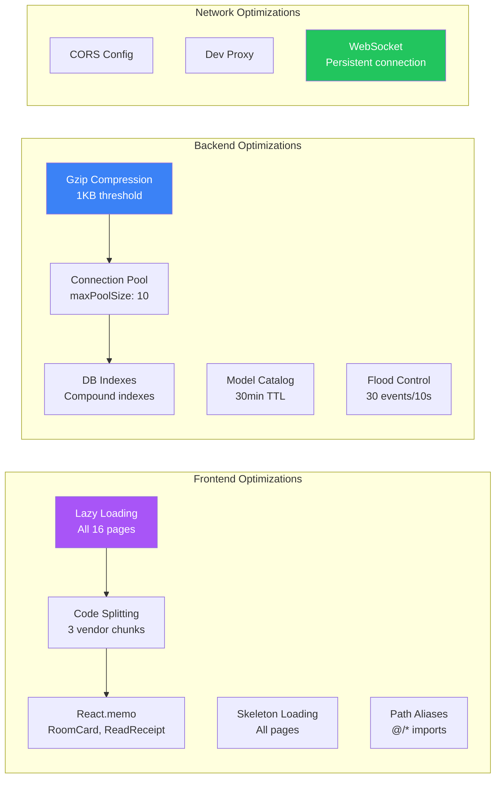

---

*Generated for ChatSphere — AI-powered multi-provider chat platform*
